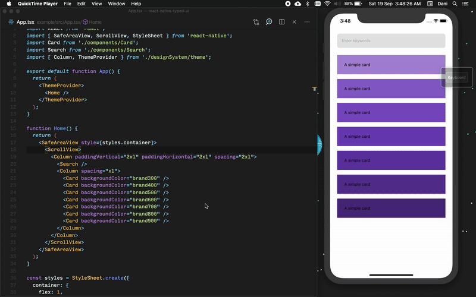

<div align="center">


# React Native Typed UI

A strongly typed themeable design system for react native

[![Build Status][build-badge]][build]
[![Maintainability][maintainability-badge]][maintainability-url]
[![Test Coverage][coverage-badge]][coverage-url]

[![Version][version-badge]][package]
[![Downloads][downloads-badge]][npmtrends]
[![Bundlephobia][bundle-phobia-badge]][bundle-phobia]

[![Star on GitHub][github-star-badge]][github-star]
[![Watch on GitHub][github-watch-badge]][github-watch]
[![Twitter Follow][twitter-badge]][twitter]

[![donate][coffee-badge]][coffee-url]
[![sponsor][sponsor-badge]][sponsor-url]
[![support][support-badge]][support-url]

[![Storybook][storybook-badge]][storybook-url] [![Chromatic][chromatic-badge]][chromatic]

</div>



```js
import TypedUi from 'react-native-typed-ui';

// ...

const result = await TypedUi.multiply(3, 7);
```

## Contributing

See the [contributing guide](CONTRIBUTING.md) to learn how to contribute to the repository and the development workflow.

## License

MIT

[expo-app]: https://expo.io/@daniakash/react-native-typed-ui-example
[coffee-badge]: https://img.shields.io/badge/-%E2%98%95%EF%B8%8F%20buy%20me%20a%20coffee-e85b46
[coffee-url]: https://www.buymeacoffee.com/daniakash
[sponsor-badge]: https://img.shields.io/badge/-%F0%9F%8F%85%20sponsor%20this%20project-e85b46
[sponsor-url]: https://www.buymeacoffee.com/daniakash/e/6983
[support-badge]: https://img.shields.io/badge/-Get%20Support-e85b46
[support-url]: https://www.buymeacoffee.com/daniakash/e/7030
[build]: https://github.com/react-native-toolkit/react-native-typed-ui/actions
[build-badge]: https://github.com/react-native-toolkit/react-native-typed-ui/workflows/build/badge.svg
[coverage-badge]: https://api.codeclimate.com/v1/badges/77497dc0bdd2f2360f2f/test_coverage
[coverage-url]: https://codeclimate.com/github/react-native-toolkit/react-native-typed-ui/test_coverage
[maintainability-badge]: https://api.codeclimate.com/v1/badges/77497dc0bdd2f2360f2f/maintainability
[maintainability-url]: https://codeclimate.com/github/react-native-toolkit/react-native-typed-ui/maintainability
[bundle-phobia-badge]: https://badgen.net/bundlephobia/minzip/react-native-typed-ui
[bundle-phobia]: https://bundlephobia.com/result?p=react-native-typed-ui
[downloads-badge]: https://img.shields.io/npm/dm/react-native-typed-ui.svg
[npmtrends]: http://www.npmtrends.com/react-native-typed-ui
[package]: https://www.npmjs.com/package/react-native-typed-ui
[version-badge]: https://img.shields.io/npm/v/react-native-typed-ui.svg
[twitter]: https://twitter.com/dani_akash_
[twitter-badge]: https://img.shields.io/twitter/follow/dani_akash_?style=social
[github-watch-badge]: https://img.shields.io/github/watchers/react-native-toolkit/react-native-typed-ui.svg?style=social
[github-watch]: https://github.com/react-native-toolkit/react-native-typed-ui/watchers
[github-star-badge]: https://img.shields.io/github/stars/react-native-toolkit/react-native-typed-ui.svg?style=social
[github-star]: https://github.com/react-native-toolkit/react-native-typed-ui/stargazers
[storybook-badge]: https://cdn.jsdelivr.net/gh/storybookjs/brand@master/badge/badge-storybook.svg
[storybook-url]: https://typedui.netlify.app
[chromatic-badge]: https://img.shields.io/badge/-chromatic-%23fc521f
[chromatic]: https://chromatic.com/library?appId=5f66cecfa3029000225968dc&branch=master
